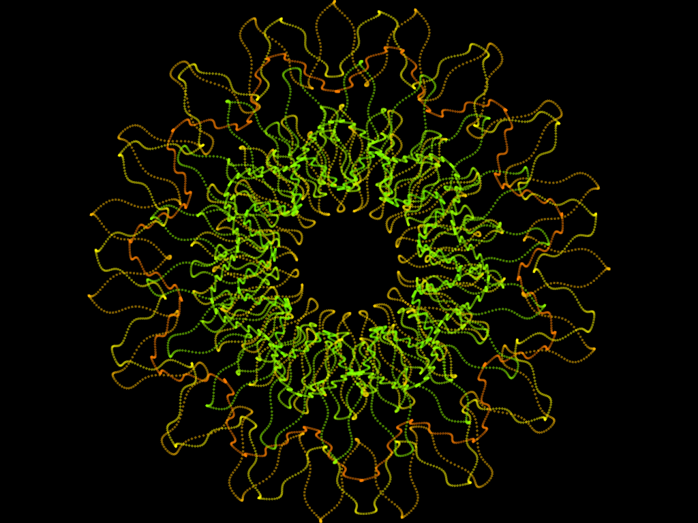
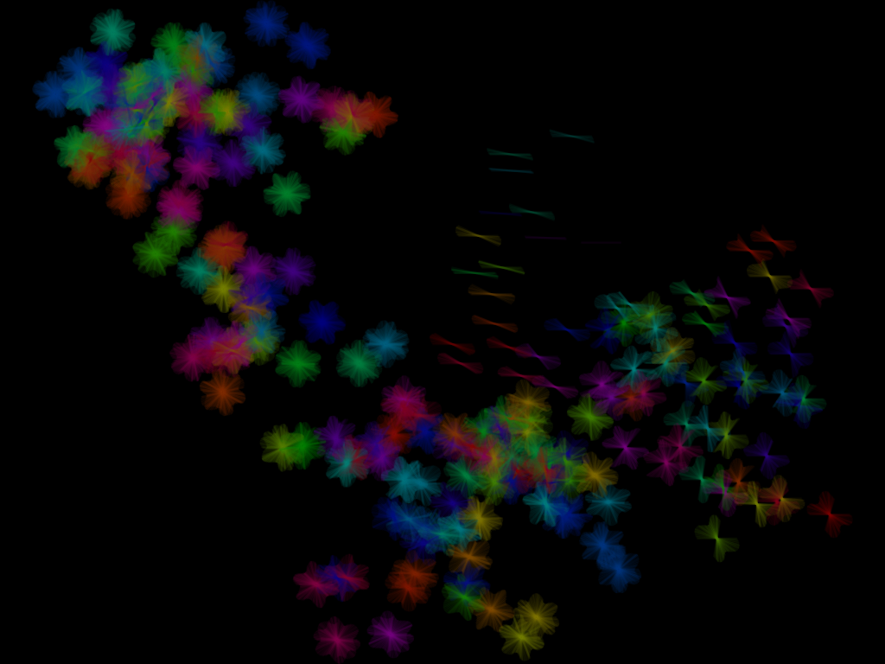

# racket-stamps-examples
Example generative artwork produced with racket-stamps

https://github.com/rodrigosetti/stamps and https://github.com/ericclack/racket-stamps

All work in this repo Copyright Eric Clack 2017. This work is licensed under a [Creative Commons Attribution-ShareAlike 4.0 International License](http://creativecommons.org/licenses/by-sa/4.0/).

## Square Spikes 4

[Source code](examples/square-spikes4.rkt)

## Hills 2

[Source code](examples/hills2.rkt)

## Circles 2

[Source code](examples/circles2.rkt)

## Flowers or Butterflies?

[Source code](examples/flowers-or-butterflies.rkt)
