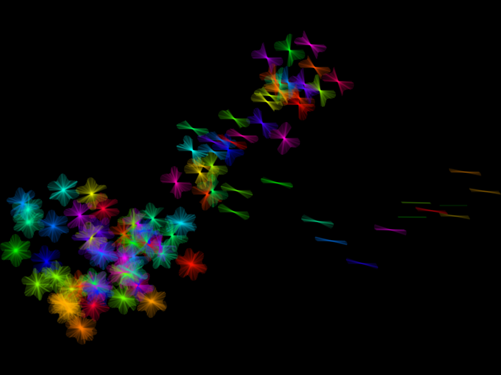

# racket-stamps-examples
Example generative artwork produced with racket-stamps

https://github.com/rodrigosetti/stamps and https://github.com/ericclack/racket-stamps

All work in this repo Copyright Eric Clack 2017. Creative commons licence to follow...

## Flowers or Butterflies?

[Source code](examples/flowers-or-butterflies.rkt)
